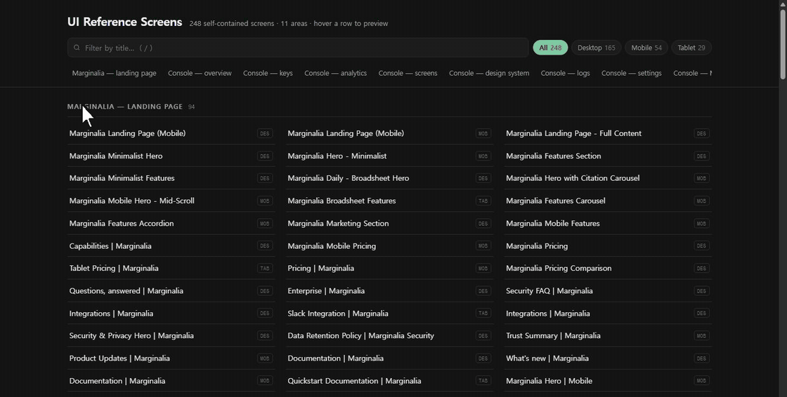
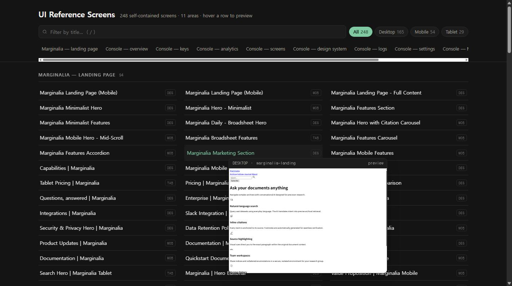
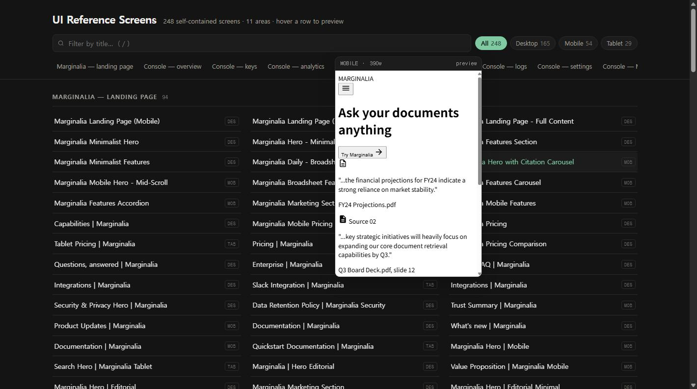

<h1 align="center">UI संदर्भ स्क्रीन</h1>

<p align="center">
  [English](../readme/README.en.md) | [한국어](../readme/README.ko.md) | [简体中文](../readme/README.zh.md) | [日本語](../readme/README.ja.md) | [Español](../readme/README.es.md) | [Français](../readme/README.fr.md) | [Русский](../readme/README.ru.md) | [العربية](../readme/README.ar.md) | **हिन्दी** • [📜 परिवर्तन-सूची](../changelog/CHANGELOG.hi.md)
</p>

---

> 248 स्वतंत्र HTML संदर्भ स्क्रीन — एक API गेटवे संचालन कंसोल और एक संपादकीय लैंडिंग पेज।

### [▶ लाइव गैलरी](https://krcupro.github.io/ui-reference-screens/)

ब्राउज़र में सभी स्क्रीन देखें

## यह कैसा दिखता है



*किसी भी पंक्ति पर कर्सर ले जाएँ और असली स्क्रीन का पूर्वावलोकन देखें; शीर्षक या व्यूपोर्ट से छाँटें।*

| डेस्कटॉप स्क्रीन 1280px पर रेंडर होती हैं | मोबाइल स्क्रीन 390px पर रेंडर होती हैं |
| --- | --- |
|  |  |

## मुख्य बातें

- **कर्सर ले जाते ही पूर्वावलोकन।** किसी पंक्ति की ओर इशारा करते ही असली स्क्रीन वहीं रेंडर हो जाती है — कोई थंबनेल नहीं, कहीं और से कुछ लाया भी नहीं जाता।
- **अपने-अपने व्यूपोर्ट पर।** मोबाइल लेआउट 390px पर और डेस्कटॉप 1280px पर दिखता है, इसलिए न सिकुड़ता है न धुंधला होता है।
- **स्वयंपूर्ण फ़ाइलें।** हर स्क्रीन एक ही HTML फ़ाइल है, जो बिना किसी बिल्ड के ब्राउज़र में खुल जाती है।
- **टाइप करते ही छँटाई।** शीर्षक से खोजें, व्यूपोर्ट से सीमित करें, क्षेत्रों के बीच जाएँ; `/` दबाकर सीधे खोज बॉक्स पर पहुँचें।
- **हल्का और गहरा।** गैलरी सिस्टम थीम का अनुसरण करती है।

## सामग्री

| क्षेत्र | स्क्रीन |
| --- | ---: |
| Marginalia — लैंडिंग पेज | 94 |
| कंसोल — अवलोकन | 25 |
| कंसोल — कुंजियाँ | 18 |
| कंसोल — विश्लेषण | 17 |
| कंसोल — स्क्रीन | 12 |
| कंसोल — डिज़ाइन सिस्टम | 21 |
| कंसोल — लॉग | 7 |
| कंसोल — सेटिंग्स | 13 |
| कंसोल — MCP | 6 |
| कंसोल — प्लेग्राउंड | 2 |
| कंसोल — अन्य | 33 |
| **कुल** | **248** |

## व्यूपोर्ट

| व्यूपोर्ट | स्क्रीन | रेंडर चौड़ाई |
| --- | ---: | --- |
| Desktop | 165 | 1280px |
| Mobile | 54 | 390px |
| Tablet | 29 | 834px |

## संरचना

```
index.html                 gallery
catalog.json               metadata for all 248 screens
screens/
  marginalia-landing/      94
  operations-console/      154
docs/
  readme/                  9 languages
  changelog/               9 languages
  assets/
```

## इसका उपयोग कैसे करें

1. [लाइव गैलरी](https://krcupro.github.io/ui-reference-screens/) खोलें — कुछ भी इंस्टॉल करने की ज़रूरत नहीं।
2. या इसे क्लोन करके `index.html` सीधे खोलें:

```bash
git clone https://github.com/KRCUPRO/ui-reference-screens.git
cd ui-reference-screens
# open index.html
```

## `catalog.json`

हर स्क्रीन के लिए एक प्रविष्टि:

```json
{
  "file": "screens/operations-console/overview/dashboard-overview.html",
  "title": "Dashboard Overview",
  "category": "operations-console/overview",
  "device": "DESKTOP",
  "prompt": "⚡ 외부 MCP 에이전트 연동으로 생성됨",
  "createdAt": "2026-08-31T13:54:01.252Z"
}
```

## टिप्पणियाँ

- स्क्रीन स्थिर मॉकअप हैं। इनमें दिखाया गया हर मान उदाहरण के लिए गढ़ा गया है — कोई वास्तविक खाता, कुंजी, होस्ट या निजी डेटा कहीं नहीं है।
- केवल टाइपोग्राफ़ी नेटवर्क से Google Fonts से आती है; बाकी सब इनलाइन है।
- कुछ शीर्षक अलग-अलग स्थितियों में दोहराए जाते हैं — लोडिंग, खाली, त्रुटि, पहली बार, निम्नीकृत।

---

<p align="center">
  <a href="https://krcupro.github.io/ui-reference-screens/">लाइव गैलरी</a> · <a href="../../README.md">मुख्य README पर लौटें</a>
</p>
